# OhMyPi (OMP) Spec-Driven Development Framework

> **Production-Grade Autonomous AI Engineering Infrastructure**


---

## Table of Contents

- [The Problem: Agentic Chaos in Production](#the-problem-agentic-chaos-in-production)
- [The Solution: Three Pillars of SDD](#the-solution-three-pillars-of-sdd)
- [Core Architectural Boundary](#core-architectural-boundary)
- [System Architecture](#system-architecture)
- [Deterministic Workflow](#deterministic-workflow)
- [Core Principles](#core-principles)
- [Lifecycle Skills](#lifecycle-skills)
- [Infrastructure Skills](#infrastructure-skills)
- [Templates & Artifacts](#templates--artifacts)
- [Directory Standards](#directory-standards)
- [Quick Start](#quick-start)
- [Why SDD Wins](#why-sdd-wins)
- [License](#license)
- [About the Developer & ParlanTech](#about-the-developer--parlantech)

---

## The Problem: Agentic Chaos in Production

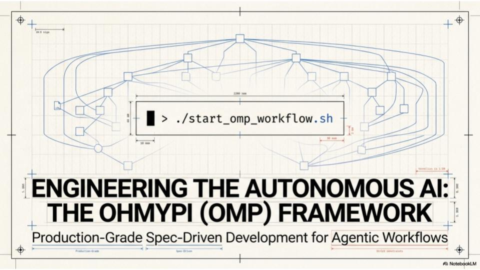

Standard agentic systems fail systematically:

| Failure Type          | Example                                                                   |
| --------------------- | ------------------------------------------------------------------------- |
| **CONTEXT_LOST**      | ERR: 0x4F04 — Context lost between agents                                 |
| **WRITE_FAILURE**     | `/src/workflow/agent.py` [OVERWRITTEN] — Agents overwrite without reading |
| **LOOP_DETECTED**     | Infinite loops from non-deterministic logic                               |
| **NON_DETERMINISTIC** | Ambiguous tool selection, unpredictable exits                             |

> **"We need engineering discipline, not just smarter models."**

---

## The Solution: Three Pillars of SDD

### Pillar 1: One Transform at a Time

Single-responsibility skills. Each agent performs exactly one transformation with no cross-cutting concerns.

- _Visual:_ Clean, unidirectional data flow with no cross-cutting concerns.

### Pillar 2: Deterministic Outputs

Pure-function tool invocation. Agents parse and read state before writing — no hidden state mutations.

- _Visual:_ Controlled flow where inputs are parsed, processed through deterministic logic gates, and produce predictable outputs.

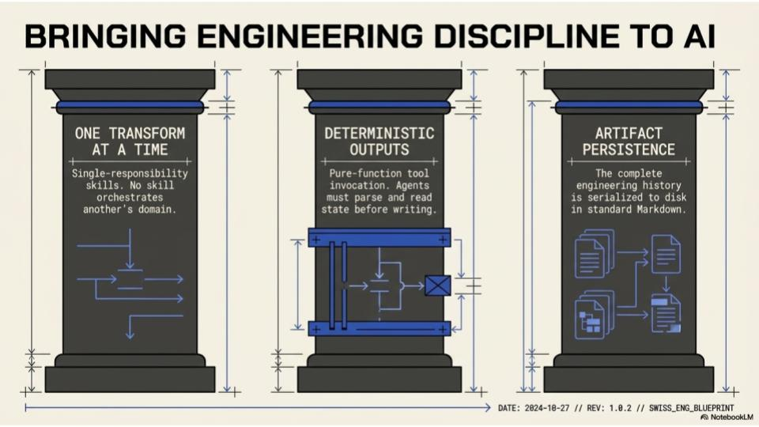

- _Visual:_ Documents flowing through a structured pipeline, each version immutable and traceable.

### Pillar 3: Artifact Persistence

Immutable event sourcing. Each agent writes to new artifacts rather than modifying existing files.

- _Visual:_ Every transformation produces a new artifact; originals remain untouched until archival.

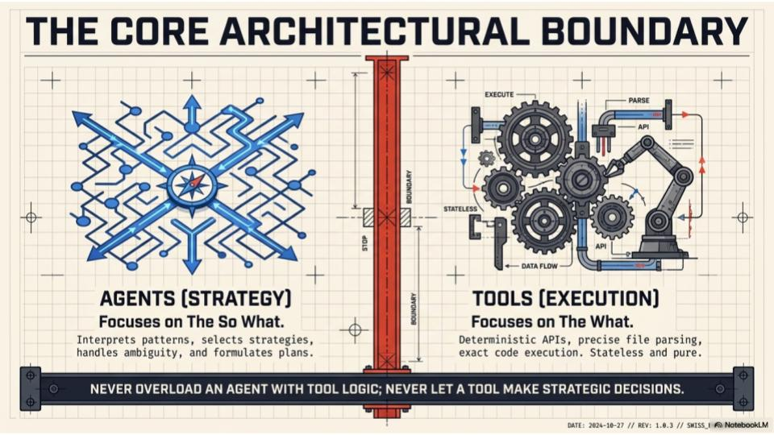

### 💡 Wisdom

These three pillars map directly to foundational software engineering principles:

- **Single Responsibility Principle** (SOLID) — One Transform at a Time
- **Pure Functions / Referential Transparency** — Deterministic Outputs
- **Immutable Event Sourcing** — Artifact Persistence

The genius is applying these _to agent orchestration_ rather than just code. Most agent frameworks treat LLMs as magical black boxes; OMP treats them as components in a rigorous engineering system. The "parse and read state before writing" rule is particularly crucial — it prevents the common failure mode where an agent hallucinates the current state and overwrites working code.

---

## Core Architectural Boundary

### Agents [Strategy] ↔ Tools [Execution]

**AGENTS [Strategy]**

- Focuses on **The So What**
- Interprets patterns
- Selects strategies
- Handles ambiguity
- Formulates plans
- Transforms artifacts between stages
- Makes high-level decisions

**TOOLS [Execution]**

- Focuses on **The What**
- Deterministic APIs
- Precise file parsing
- Exact code execution
- State-based tool selection
- Write access to files
- Stateless and pure

> **"Never overload an agent with tool logic; never let a tool make strategic decisions."**

### 💡 Wisdom

This is the **Strategy Pattern** applied at the architectural level. Agents are the _context-aware deciders_; tools are the _context-free doers_. This boundary prevents two critical anti-patterns:

1. **The Swiss Army Knife Agent** — When an agent contains too much tool logic, it becomes bloated, slow, and unpredictable. Tool selection becomes ambiguous.
2. **The Clever Tool** — When tools make strategic decisions, they become non-deterministic. A tool that "decides" how to parse a file based on context is no longer a tool — it's a hidden agent.

This separation enables **testability**: tools can be unit-tested with perfect reproducibility, while agents can be evaluated on decision quality.

---

## System Architecture

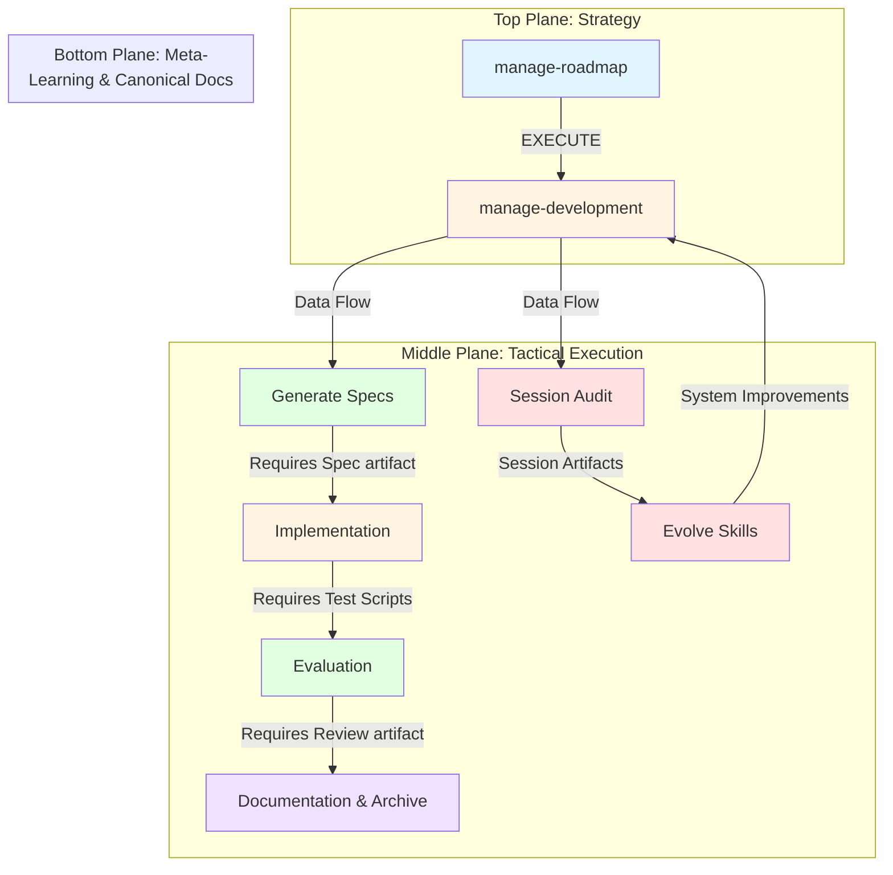

**Dual-Layer Management Architecture**:

| Strategic Layer                                   | Tactical Layer                                      |
| ------------------------------------------------- | --------------------------------------------------- |
| `manage-roadmap`                                  | `manage-development`                                |
| Defines roadmap priorities and creates milestones | Orchestrates the SDD pipeline for active milestones |
| Sets the "What & Why"                             | Guides the "How" execution                          |

**Structural Feedback Loop**:

- Tactical Lifecycle Engine delivers: requirements, constraints, workshop notes, critical points
- Meta-Learning returns: data and action memory as system constraints, patterns, and decision points

> **"A unified, closed-loop system where high-level vision is systematically decomposed into verifiable, executed code."**

### 💡 Wisdom

This is a **hierarchical control system** inspired by:

- **Management hierarchies** (Strategic → Tactical → Operational)
- **Computer architecture** (Application → OS → Hardware)
- **Biological systems** (Brain → Spinal Cord → Reflex Arcs)

The feedback loop is critical — it's not just top-down decomposition. The bottom layer _learns_ from execution and feeds constraints back up. This creates a **self-improving system** where institutional knowledge accumulates in canonical docs rather than being lost in context windows.

The "Spec-Driven Assembly Line" metaphor is deliberate: manufacturing achieved reliability through assembly lines (Ford), not by making individual craftsmen more skilled. Similarly, OMP achieves reliable AI engineering through process, not through better prompting.

---

## Deterministic Workflow

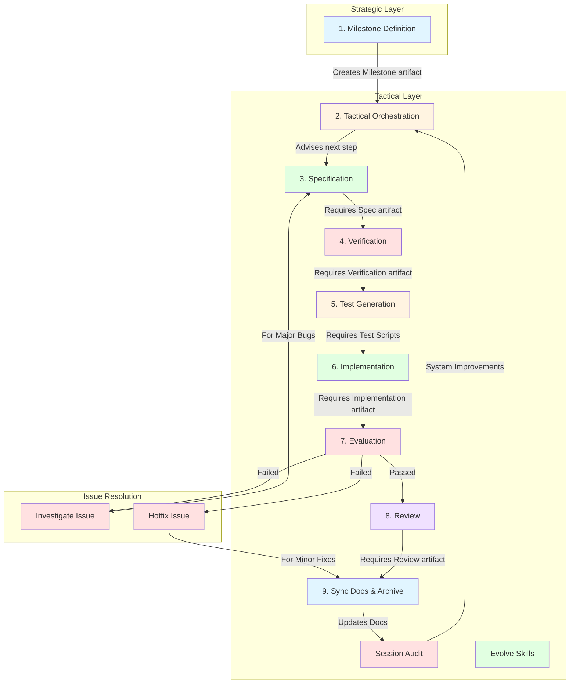

> **"AI agents don't just write code. They advance artifacts through a strict deterministic workflow. Each stage strictly requires the completion of the previous artifact."**

### 💡 Wisdom

This is **Waterfall done right** — not as a rigid methodology, but as a _state machine_. The key insight is that **stages don't proceed until the artifact is complete**. This prevents the "90% done" trap where implementation starts before requirements are understood.

The "strictly requires completion" rule means:

- No coding during specification
- No testing during coding
- No reviewing during testing

This seems slow, but it prevents the **context thrashing** that kills productivity in standard agentic workflows. Each agent enters with a clear mandate and exits with a complete artifact.

### Extended Workflow: Issue Resolution

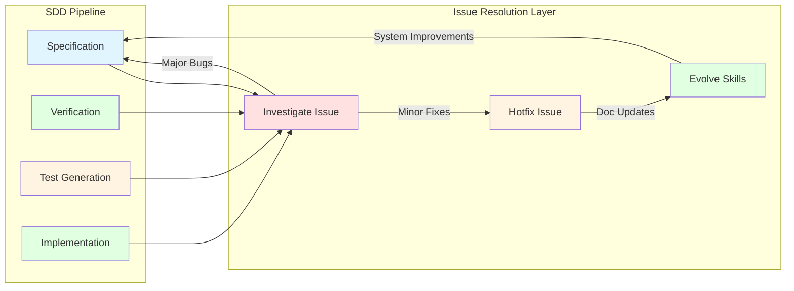

### 📊 Project Workflow vs Issue Resolution

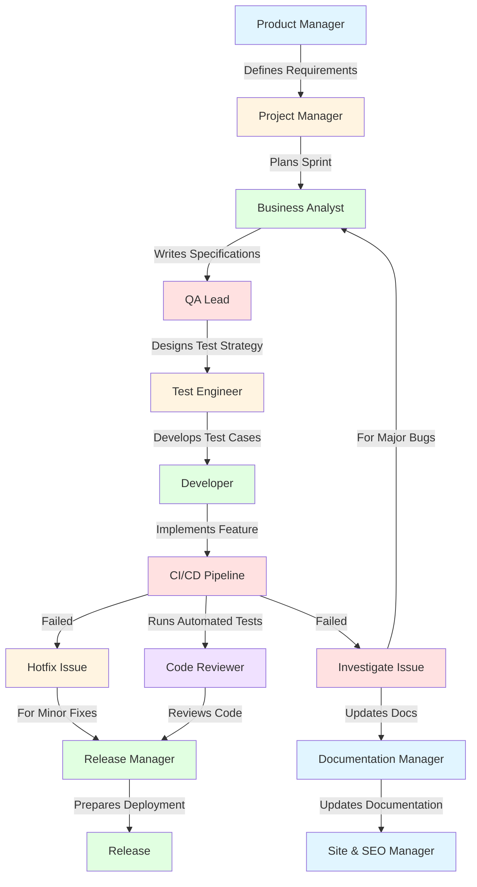

> **"AI agents don't just write code. They advance artifacts through a strict deterministic workflow. Each stage strictly requires the completion of the previous artifact."**

---

## Core Principles

1. **Agent/Tool Separation** — Strategy vs. Execution
2. **One Transform at a Time** — Single responsibility
3. **Deterministic Outputs** — Pure functions, no hidden state
4. **Artifact Persistence** — Immutable, versioned Markdown
5. **Spec Before Code** — Verification precedes implementation
6. **Disjoint File Edits** — Parallel agents, no race conditions
7. **Read-Only Audit** — Analysis without modification
8. **Investigate Before Patch** — Root cause, not symptom
9. **Skill Evolution & Meta-Learning** — Analyzes project artifacts to improve agent prompts and skill definitions.
10. **Human Checkpoints** — Completion reports, not auto-proceed

---

## Lifecycle Skills

**Strategic Layer** — Define project-level strategies, roadmaps, and governance:

| Skill                     | Description                                                  | Handoff                                        |
| ------------------------- | ------------------------------------------------------------ | ---------------------------------------------- |
| `manage-roadmap`          | Strategic PM: Creates milestones from roadmap priorities     | Hands off to `manage-development`              |
| `manage-development`      | Tactical EM: Orchestrates SDD pipeline for active milestones | Advises next skill in sequence                 |
| `sync-documentation`      | Updates canonical docs, archives milestone                   | Lifecycle complete                             |
| `archive-milestone`       | Archives completed milestone artifacts while preserving history | Lifecycle complete                             |
| `evolve-skills`           | Analyzes recent artifacts to learn from mistakes, updates SKILL.md files | Updates framework (optional)                  |

**Core Development Layer** — Implement the specification-driven development workflow:

| Skill                     | Description                                                  | Handoff                                        |
| ------------------------- | ------------------------------------------------------------ | ---------------------------------------------- |
| `milestone`               | Transforms rough feature ideas into complete milestone documents through interactive requirements elicitation | `generate-spec`                               |
| `generate-spec`           | Transforms milestone → specification                         | `generate-verification`                        |
| `generate-verification`   | Transforms specification → verification                      | `generate-tests`                               |
| `generate-tests`          | Transforms verification → test scripts                       | `implement-specification`                      |
| `implement-specification` | Transforms test scripts → implementation                     | `evaluate-implementation`                      |
| `evaluate-implementation` | Executes tests, fixes bugs, generates evaluation             | `review-implementation` or `investigate-issue` |
| `review-implementation`   | Evaluates implementation against spec                        | `sync-documentation`                           |

**Support Layer** — Assist with specific concerns:

| Skill                     | Description                                                  | Handoff                                        |
| ------------------------- | ------------------------------------------------------------ | ---------------------------------------------- |
| `investigate-issue`       | Analyzes failures, produces investigation report             | `generate-spec` (for incremental spec)         |
| `hotfix-issue`            | Implements minor fixes directly                              | `sync-documentation`                           |

---

## Infrastructure Skills

**Purpose**: Provide foundational capabilities for understanding, analyzing, and processing the codebase and documentation.

### code-search

**Role**: Semantic search and skeleton generation for understanding code structure without reading files.

**Key Responsibilities**:
- Provides semantic search across the OMP AEF codebase
- Generates tree-sitter skeletons for codebase structure
- Enables fast understanding of patterns without reading files
- Supports framework improvements and consistency checks
- Creates vector embeddings for semantic search (per-project)

**Artifacts**:
- `docs/skeletons/OMP-AEF_skeleton.md` — Tree-sitter extracted signatures and imports
- `code_index_code_search.db` — Vector embeddings for semantic search (per-project)

**Usage Patterns**:
- Find agent handoff patterns across multiple files
- Identify template usage and consistency
- Verify negative guardrails implementation
- Search for milestone progress tracking
- Check code-search integration in skills

**Out of Scope**:
- Detailed implementation review (use LSP instead)
- Running tests or executing code
- Modifying codebase structure
- Generating new features

**Access**:
```bash
# Semantic search (via agent invocation)
task(role: "code-search", assignment: "Search for all milestone-related code")

# CLI usage
python3 ~/devcode/aef/agent/skills/code-search/code_indexer.py --index
python3 ~/devcode/aef/agent/skills/code-search/code_search.sh "milestone" skills/
```

---

## Templates & Artifacts

### Milestone Artifacts

Each milestone produces a set of artifacts tracked in `milestones/M{X}/`:

+- **M{X}.md** — Milestone definition (problem statement, goals, success criteria)
+- **M{X}S{Y}.md** — Specification (functional requirements, architecture impact)
+- **M{X}S{Y}V.md** — Verification protocol (test cases, edge cases)
+- **M{X}S{Y}T{Z}.md** — Test plan documentation
+- **M{X}S{Y}C.md** — Completion report (implementation status)
+- **M{X}S{Y}E.md** — Evaluation report (test results, bug fixes)
+- **M{X}S{Y}R.md** — Review report (compliance analysis)
+- **M{X}SA{Y}.md** — Session audit document
+- **SESSION_CHANGES.md** — Session change log
+- **CHANGELOG_ENTRIES.md** — Changelog entries
+- **MILESTONE_UPDATES.md** — Milestone updates
+- **INGEST_ENTRIES.md** — Ingestion entries for `/docs/ingest/`

### Artifact Lifecycle

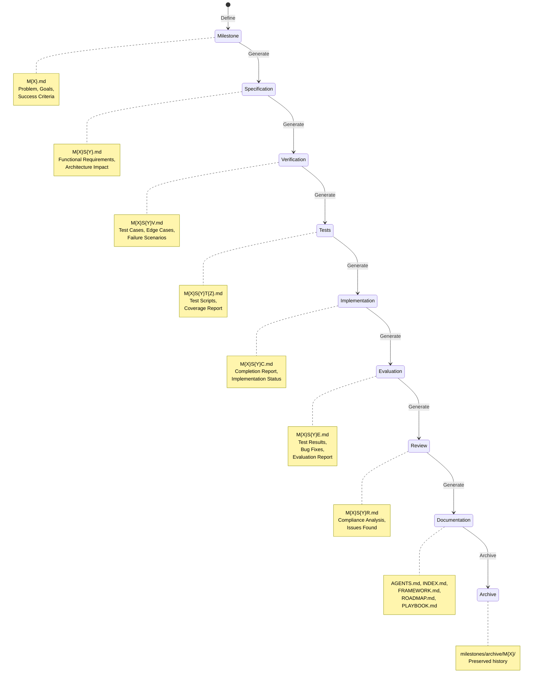
## Directory Standards

| Document                      | Description                                                     |
| ----------------------------- | --------------------------------------------------------------- |
| `README.md`                   | Project overview, design principles, quick start, license       |
| `AGENTS.md`                   | Agent documentation, build/test commands, tool patterns         |
| `INDEX.md`                    | Quick navigation, agent overview, workflow diagrams             |
| `ROADMAP.md`                  | Existing capabilities as completed items and future items       |
| `FRAMEWORK.md`                | Architectural patterns, module organization, extension guidelines |
| `PLAYBOOK.md`                 | How to run/test/deploy, operational procedures, common tasks    |
| `CHANGELOG.md`                | Chronological record of changes and version history             |
| `docs/EXPERIENCES.md`         | Meta-learning ledger tracking framework friction and applied skill updates |
| `docs/SPEC.md`                | Current system architecture as specification                    |
| `docs/DATA.md`                | Database schema, configuration schema, data flow patterns       |
| `docs/MILESTONES.md`          | List of active and archived milestones                          |
| `milestones/`                 | Milestone-specific artifacts (specs, tests, implementations)   |
| `milestones/archive/`         | Archived completed milestones (read-only)                       |
| `docs/ingest/`                | Ingestion workflow for documentation processing and archival   |
| `templates/`                  | Template files for artifact generation (*.template.md)         |
| `skills-lock.json`            | Skill configuration and dependencies                            |
| `config.yml`                  | Model routing and framework configuration                       |

**Directory Structure**:
- **Root**: Configuration, core documentation, skills
- **docs/**: Framework documentation and reference materials
- **milestones/**: Active milestone work (M{X}/)
- **milestones/archive/**: Completed milestone artifacts
- **docs/ingest/**: Files ready for documentation processing
- **templates/**: Reusable templates for artifact generation
- **skills/**: Agent skill definitions (SKILL.md files)
- **tests/**: Test suites for verification (M{X}/)

**Session Artifacts**: Session audit documents and change logs (SESSION_CHANGES.md, CHANGELOG_ENTRIES.md, MILESTONE_UPDATES.md, INGEST_ENTRIES.md) are generated directly in the milestone folder (`milestones/M{X}/` or `milestones/TEMP/`). The `/docs/ingest/` folder is used for archival after processing by manage-roadmap.

---


## Why SDD Wins

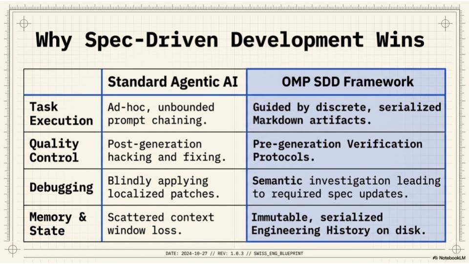

| Dimension     | Standard Agentic AI    | OMP SDD                              |
| ------------- | ---------------------- | ------------------------------------ |
| **Execution** | Ad-hoc prompt chaining | Serialized artifacts                 |
| **Quality**   | Post-generation fixes  | Pre-generation verification          |
| **Debugging** | Localized patches      | Semantic investigation → spec update |
| **Memory**    | Context window loss    | Immutable disk history               |

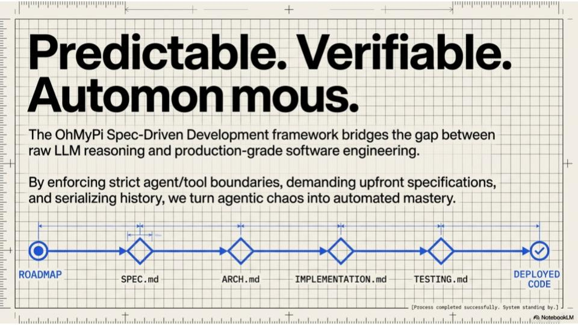

### Meta-Learning Loop

```mermaid
graph LR
    A[Session Audit] -->|Artifacts| B[Evolve Skills]
    B -->|Skill Updates| C[SKILL.md Files]
    C -->|Framework Improvements| D[Framework Docs]
    D -->|Updated Practices| E[Manage Development]
    E -->|Better Execution| F[Artifacts]

    style A fill:#ffe1e1
    style B fill:#e1ffe1
    style C fill:#e1f5ff
    style D fill:#fff4e1
    style E fill:#e1ffe1
    style F fill:#ffe1e1
```

The session audit and evolve-skills workflow ensures:
- **Continuous Improvement**: Learn from every session
- **Consistency**: Standardized patterns across all skills
- **Traceability**: Full history of decisions and changes
- **Quality**: Systematic reduction of friction

---

## License

This project is licensed under the **MIT License**.

### MIT License

```
MIT License

Copyright (c) 2024-2026 Barış Parlan

Permission is hereby granted, free of charge, to any person obtaining a copy
of this software and associated documentation files (the "Software"), to deal
in the Software without restriction, including without limitation the rights
to use, copy, modify, merge, publish, distribute, sublicense, and/or sell
copies of the Software, and to permit persons to whom the Software is
furnished to do so, subject to the following conditions:

The above copyright notice and this permission notice shall be included in all
copies or substantial portions of the Software.

THE SOFTWARE IS PROVIDED "AS IS", WITHOUT WARRANTY OF ANY KIND, EXPRESS OR
IMPLIED, INCLUDING BUT NOT LIMITED TO THE WARRANTIES OF MERCHANTABILITY,
FITNESS FOR A PARTICULAR PURPOSE AND NONINFRINGEMENT. IN NO EVENT SHALL THE
AUTHORS OR COPYRIGHT HOLDERS BE LIABLE FOR ANY CLAIM, DAMAGES OR OTHER
LIABILITY, WHETHER IN AN ACTION OF CONTRACT, TORT OR OTHERWISE, ARISING FROM,
OUT OF OR IN CONNECTION WITH THE SOFTWARE OR THE USE OR OTHER DEALINGS IN THE
SOFTWARE.
```

**Full License**: [https://opensource.org/licenses/MIT](https://opensource.org/licenses/MIT)

### Usage

- **Free to use** in commercial and non-commercial projects
- **Free to modify** and distribute modified versions
- **Open source** — encourages contributions and improvements
- **Permissive** — no attribution required (but appreciated)

---

## About the Developer & ParlanTech

Developed by **[Barış Parlan](https://bparlan.com/)**.

Barış Parlan is an independent technology consultant and Agentic Engineer dedicated to building technology that augments human capability and enhances human agency, rather than increasing dependence.

The OhMyPi (OMP) Agentic Engineering Framework is a core project developed under his independent engineering lab, **ParlanTech**. The framework reflects a deep commitment to exploring how autonomous software can expand developer empowerment through:
- **Local-first AI** — Private, offline-first AI capabilities
- **Specification-driven workflows** — Rigorous process over unguided prompting
- **Robust agent collaboration** — Clear boundaries and deterministic execution

### Consulting & Collaboration

Barış is actively open to consulting opportunities, research collaborations, and builder residencies. His expertise is tailored to help AI companies, developer tool platforms, and open-source ecosystems design, architect, and implement production-grade agentic systems.

If your organization is looking to build stable AI workflows, optimize developer experiences, or transition into agentic architectures, he is available for technical partnership and consulting.

### Support Independent Engineering

This framework—alongside other projects like [Autonomedia](https://github.com/bparlan/autonomedia) and [Baria](https://github.com/bparlan/baria)—is built on a foundational belief in:
- **Open knowledge** — Free, accessible technical documentation
- **Building in public** — Transparent development process
- **Open protocols** — Standards-based, interoperable systems

As an independent developer, sustaining this level of deep, architectural research requires financial stability. If you or your organization derive value from the OMP framework and wish to see it advance, financial contributions and open-source sponsorships are highly welcomed.

Your support directly sustains this independent engineering effort, ensuring the continued development of these critical technological frontiers without the need for traditional gatekeepers.

### External Projects

- **[Autonomedia](https://github.com/bparlan/autonomedia)** — Autonomous media generation and publishing
- **[Baria](https://github.com/bparlan/baria)** — Local-first AI applications

### Contact

- **Website**: [https://bparlan.com/](https://bparlan.com/)
- **GitHub**: [@bparlan](https://github.com/bparlan)
- **Twitter**: [@bparlan](https://twitter.com/bparlan)

For consulting inquiries, sponsorships, or to offer financial support, please reach out via GitHub or the contact channels provided on the website.

---

## Acknowledgments

This framework draws inspiration from:
- **Software Engineering Principles** — SOLID, Clean Code, Design Patterns
- **AI Research** — Agentic workflows, tool use, multi-agent systems
- **DevOps Practices** — CI/CD, infrastructure as code, monitoring
- **Open Source Communities** — Collaborative development and knowledge sharing

---

## Contributing

While this is primarily an independent project, contributions are welcome:
1. Report issues and bugs
2. Suggest improvements and enhancements
3. Submit pull requests for fixes and features
4. Share your experiences and use cases

See [AGENTS.md](./AGENTS.md) for detailed contribution guidelines.

---

## Resources

- **[Documentation](./docs)** — Comprehensive framework documentation
- **[Roadmap](./ROADMAP.md)** — Project roadmap and feature planning
- **[Sessions](./sessions)** — Session audit reports and change logs
- **[Examples](./milestones)** — Example milestone artifacts

---

**Last Updated**: 2026-07-18
**Version**: 1.0.0
**Status**: Production-Ready
---

## References

- **[skills.md](../docs/skills.md)** — Comprehensive skill catalog
- **[INDEX.md](../INDEX.md)** — Complete skill catalog
- **[AGENTS.md](../AGENTS.md)** — Framework overview
- **[PLAYBOOK.md](../docs/PLAYBOOK.md)** — Operational workflows
- **[FRAMEWORK.md](../docs/FRAMEWORK.md)** — Architecture patterns

## References

- **[skills.md](../docs/skills.md)** — Comprehensive skill catalog
- **[INDEX.md](../INDEX.md)** — Complete skill catalog
- **[AGENTS.md](../AGENTS.md)** — Framework overview
- **[PLAYBOOK.md](../docs/PLAYBOOK.md)** — Operational workflows
- **[FRAMEWORK.md](../docs/FRAMEWORK.md)** — Architecture patterns
