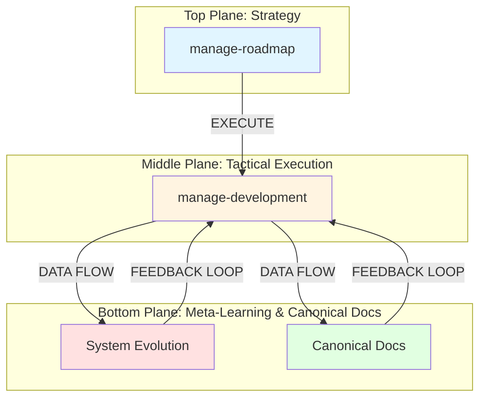

# OhMyPi (OMP) Spec-Driven Development Framework

> **Production-Grade Autonomous AI Engineering Infrastructure**

---

## 1. The Problem: Agentic Chaos in Production

Standard agentic systems fail systematically:

| Failure Type | Example |
|-------------|---------|
| **CONTEXT_LOST** | ERR: 0x4F04 — Context lost between agents |
| **WRITE_FAILURE** | `/src/workflow/agent.py` [OVERWRITTEN] — Agents overwrite without reading |
| **LOOP_DETECTED** | Infinite loops from non-deterministic logic |
| **NON_DETERMINISTIC** | Ambiguous tool selection, unpredictable exits |

> **"We need engineering discipline, not just smarter models."**

---

## 2. The Solution: Three Pillars of SDD

### Pillar 1: One Transform at a Time
Single-responsibility skills. Each agent performs exactly one transformation with no cross-cutting concerns.
*   *Visual:* Clean, unidirectional data flow with no cross-cutting concerns.

### 2. Deterministic Outputs
Pure-function tool invocation. Agents parse and read state before writing — no hidden state mutations.
*   *Visual:* Controlled flow where inputs are parsed, processed through deterministic logic gates, and produce predictable outputs.

### 3. Artifact Persistence
Complete engineering history serialized to disk as human-readable Markdown artifacts.
*   *Visual:* Documents flowing through a structured pipeline, each version immutable and traceable.

### 💡 Wisdom

These three pillars map directly to foundational software engineering principles:

- **Single Responsibility Principle** (SOLID) — One Transform at a Time
- **Pure Functions / Referential Transparency** — Deterministic Outputs
- **Immutable Event Sourcing** — Artifact Persistence

The genius is applying these _to agent orchestration_ rather than just code. Most agent frameworks treat LLMs as magical black boxes; OMP treats them as components in a rigorous engineering system. The "parse and read state before writing" rule is particularly crucial — it prevents the common failure mode where an agent hallucinates the current state and overwrites working code.

---

## 3. The Core Architectural Boundary

### Agents [Strategy] ↔ Tools [Execution]

A thick red **BOUNDARY** line separates two fundamentally different domains:

**Left Side: AGENTS [Strategy]**

- Focuses on **The So What**
- Interprets patterns
- Selects strategies
- Handles ambiguity
- Formulates plans

*_Visual: A compass rose with circuit-like pathways radiating outward — representing exploration, navigation, and strategic decision-making in ambiguous spaces._

**Right Side: TOOLS [Execution]**

- Focuses on **The What**
- Deterministic APIs
- Precise file parsing
- Exact code execution
- Stateless and pure

*_Visual: Mechanical gears, pistons, and robotic arms — representing precision, repeatability, and mechanical execution._

> **"Never overload an agent with tool logic; never let a tool make strategic decisions."**

### 💡 Wisdom

This is the **Strategy Pattern** applied at the architectural level. Agents are the _context-aware deciders_; tools are the _context-free doers_. This boundary prevents two critical anti-patterns:

1. **The Swiss Army Knife Agent** — When an agent contains too much tool logic, it becomes bloated, slow, and unpredictable. Tool selection becomes ambiguous.
2. **The Clever Tool** — When tools make strategic decisions, they become non-deterministic. A tool that "decides" how to parse a file based on context is no longer a tool — it's a hidden agent.

This separation enables **testability**: tools can be unit-tested with perfect reproducibility, while agents can be evaluated on decision quality.

---

## 4. The OMP System Architecture



**Dual-Layer Management Architecture**:

| Strategic Layer | Tactical Layer |
| -------------- | -------------- |
| `manage-roadmap` | `manage-development` |
| Defines roadmap priorities and creates milestones | Orchestrates the SDD pipeline for active milestones |
| Sets the "What & Why" | Guides the "How" execution |

**Structural Feedback Loop** (blue circular arrow connecting all layers):

- Tactical Lifecycle Engine delivers: requirements, constraints, workshop notes, critical points
- Meta-Learning returns: data and action memory as system constraints, patterns, and decision points

> **"A unified, closed-loop system where high-level vision is systematically decomposed into verifiable, executed code."**

### 💡 Wisdom

This is a **hierarchical control system** inspired by:

- **Management hierarchies** (Strategic → Tactical → Operational)
- **Computer architecture** (Application → OS → Hardware)
- **Biological systems** (Brain → Spinal Cord → Reflex Arcs)

The feedback loop is critical — it's not just top-down decomposition. The bottom layer _learns_ from execution and feeds constraints back up. This creates a **self-improving system** where institutional knowledge accumulates in canonical docs rather than being lost in context windows.

The "Spec-Driven Assembly Line" metaphor is deliberate: manufacturing achieved reliability through assembly lines (Ford), not by making individual craftsmen more skilled. Similarly, OMP achieves reliable AI engineering through process, not through better prompting.

---

## Deterministic Workflow

### The Full SDD Pipeline (incorporating new layers)

```mermaid
graph TD
    subgraph "Strategic Layer"
        A[1. Milestone Definition<br/>(`manage-roadmap`)]
    end

    subgraph "Tactical Layer"
        B[2. Tactical Orchestration<br/>(`manage-development`)]
        C[3. Specification<br/>(`generate-spec`)]
        D[4. Verification<br/>(`generate-verification`)]
        E[5. Test Generation<br/>(`generate-tests`)]
        F[6. Implementation<br/>(`implement-specification`)]
        G[7. Evaluation<br/>(`evaluate-implementation`)]
        H[8. Review<br/>(`review-implementation`)]
        I[9. Sync Docs & Archive<br/>(`sync-documentation`)]
    end

    subgraph "Issue Resolution (as needed)"
        J[Investigate Issue (`investigate-issue`)]
        K[Hotfix Issue (`hotfix-issue`)]
    end

    A -->|Creates Milestone artifact| B
    B -->|Advises next step| C
    C -->|Requires Spec artifact| D
    D -->|Requires Verification artifact| E
    E -->|Requires Test Scripts| F
    F -->|Requires Implementation artifact| G
    G -- Passed --> H
    G -- Failed --> J
    G -- Failed --> K
    J -->|For Major Bugs| C
    K -->|For Minor Fixes| I
    H -->|Requires Review artifact| I

    %% Styles
    style A fill:#e1f5ff
    style B fill:#fff4e1
    style C fill:#e1ffe1
    style D fill:#ffe1e1
    style E fill:#fff4e1
    style F fill:#e1ffe1
    style G fill:#ffe1e1
    style H fill:#f0e1ff
    style I fill:#e1f5ff
    style J fill:#ffe1e1
    style K fill:#ffe1e1
```

> **"AI agents don't just write code. They advance artifacts through a strict deterministic workflow. Each stage strictly requires the completion of the previous artifact."**

### 💡 Wisdom

This is **Waterfall done right** — not as a rigid methodology, but as a _state machine_. The key insight is that **stages don't proceed until the artifact is complete**. This prevents the "90% done" trap where implementation starts before requirements are understood.

The circular gear metaphor is intentional: each stage is a mechanical transformation with fixed inputs and outputs. There's no "creativity" in moving between stages — it's a protocol.

The "strictly requires completion" rule means:
- No coding during specification
- No testing during coding
- No reviewing during testing

This seems slow, but it prevents the **context thrashing** that kills productivity in standard agentic workflows. Each agent enters with a clear mandate and exits with a complete artifact.

---

## Core Principles

1. **Agent/Tool Separation** — Strategy vs. Execution
2. **One Transform at a Time** — Single responsibility
3. **Deterministic Outputs** — Pure functions, no hidden state
4. **Artifact Persistence** — Immutable, versioned Markdown
5. **Spec Before Code** — Verification precedes implementation
6. **Disjoint File Edits** — Parallel agents, no race conditions
7. **Read-Only Audit** — Analysis without modification
8. **Investigate Before Patch** — Root cause, not symptom
9. **Meta-Learning** — System improves from every project
10. **Human Checkpoints** — Completion reports, not auto-proceed

---

## Lifecycle Skills

| Skill | Description | Handoff |
|-------|-------------|---------|
| `manage-roadmap` | Strategic PM: Creates milestones from roadmap priorities | Hands off to `manage-development` |
| `manage-development` | Tactical EM: Orchestrates SDD pipeline for active milestones | Advises next skill in sequence |
| `generate-spec` | Transforms milestone → specification | `generate-verification` |
| `generate-verification` | Transforms specification → verification | `generate-tests` |
| `generate-tests` | Transforms verification → test scripts | `implement-specification` |
| `implement-specification` | Transforms test scripts → implementation | `evaluate-implementation` |
| `evaluate-implementation` | Executes tests, fixes bugs, generates evaluation | `review-implementation` or `investigate-issue` |
| `investigate-issue` | Analyzes failures, produces investigation report | `generate-spec` (for incremental spec) |
| `hotfix-issue` | Implements minor fixes directly | `sync-documentation` |
| `review-implementation` | Evaluates implementation against spec | `sync-documentation` |
| `sync-documentation` | Updates canonical docs, archives milestone | Lifecycle complete |

---

## Quick Start

```bash
# 1. Bootstrap existing repository
$ omp bootstrap-project

# 2. Generate next milestone (strategic)
$ omp manage-roadmap    # Creates M{X}.md from roadmap priorities

# 3. Run the lifecycle (tactical)
$ omp manage-development    # Orchestrates SDD pipeline steps automatically

# 4. Archive when complete
$ omp sync-documentation   # Updates docs and archives milestone
```

---

## Stability Rules

1. Never overwrite existing specifications — incrementing `{Y}` automatically
2. Investigation reports never trigger direct implementation — route through spec
3. Implementation always produces `M{X}S{Y}C.md` completion report
4. Archive operations update `docs/MILESTONES.md` index
5. Each agent reads state before writing

---

## Why SDD Wins

| Dimension | Standard Agentic AI | OMP SDD |
|-----------|-------------------|---------|
| **Execution** | Ad-hoc prompt chaining | Serialized artifacts |
| **Quality** | Post-generation fixes | Pre-generation verification |
| **Debugging** | Localized patches | Semantic investigation → spec update |
| **Memory** | Context window loss | Immutable disk history |

---

## License

MIT — Oh My Pi Framework
