# OhMyPi (OMP) Spec-Driven Development Framework

> **Production-Grade Autonomous AI Engineering Infrastructure**


## 1. The Problem: Agentic Chaos in Production

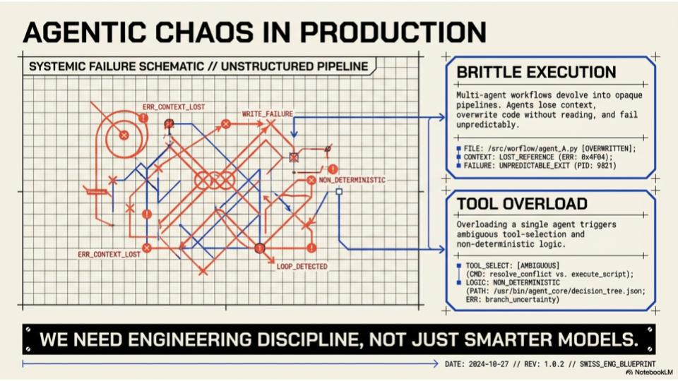

Standard agentic systems fail systematically:

| Failure Type          | Example                                                                   |
| --------------------- | ------------------------------------------------------------------------- |
| **CONTEXT_LOST**      | ERR: 0x4F04 — Context lost between agents                                 |
| **WRITE_FAILURE**     | `/src/workflow/agent.py` [OVERWRITTEN] — Agents overwrite without reading |
| **LOOP_DETECTED**     | Infinite loops from non-deterministic logic                               |
| **NON_DETERMINISTIC** | Ambiguous tool selection, unpredictable exits                             |

> **"We need engineering discipline, not just smarter models."**

---

## 2. The Solution: Three Pillars of SDD

### Pillar 1: One Transform at a Time

Single-responsibility skills. Each agent performs exactly one transformation with no cross-cutting concerns.

- _Visual:_ Clean, unidirectional data flow with no cross-cutting concerns.

### 2. Deterministic Outputs

Pure-function tool invocation. Agents parse and read state before writing — no hidden state mutations.

- _Visual:_ Controlled flow where inputs are parsed, processed through deterministic logic gates, and produce predictable outputs.


- _Visual:_ Documents flowing through a structured pipeline, each version immutable and traceable.

### 💡 Wisdom

These three pillars map directly to foundational software engineering principles:

- **Single Responsibility Principle** (SOLID) — One Transform at a Time
- **Pure Functions / Referential Transparency** — Deterministic Outputs
- **Immutable Event Sourcing** — Artifact Persistence

The genius is applying these _to agent orchestration_ rather than just code. Most agent frameworks treat LLMs as magical black boxes; OMP treats them as components in a rigorous engineering system. The "parse and read state before writing" rule is particularly crucial — it prevents the common failure mode where an agent hallucinates the current state and overwrites working code.

---

## 3. The Core Architectural Boundary

### Agents [Strategy] ↔ Tools [Execution]


**AGENTS [Strategy]**

- Focuses on **The So What**
- Interprets patterns
- Selects strategies
- Handles ambiguity
- Formulates plans

**TOOLS [Execution]**

- Focuses on **The What**
- Deterministic APIs
- Precise file parsing
- Exact code execution
  code-search capabilities
  code-search capabilities
- Stateless and pure

> **"Never overload an agent with tool logic; never let a tool make strategic decisions."**

### 💡 Wisdom

This is the **Strategy Pattern** applied at the architectural level. Agents are the _context-aware deciders_; tools are the _context-free doers_. This boundary prevents two critical anti-patterns:

1. **The Swiss Army Knife Agent** — When an agent contains too much tool logic, it becomes bloated, slow, and unpredictable. Tool selection becomes ambiguous.
2. **The Clever Tool** — When tools make strategic decisions, they become non-deterministic. A tool that "decides" how to parse a file based on context is no longer a tool — it's a hidden agent.

This separation enables **testability**: tools can be unit-tested with perfect reproducibility, while agents can be evaluated on decision quality.

---

## 4. The OMP System Architecture

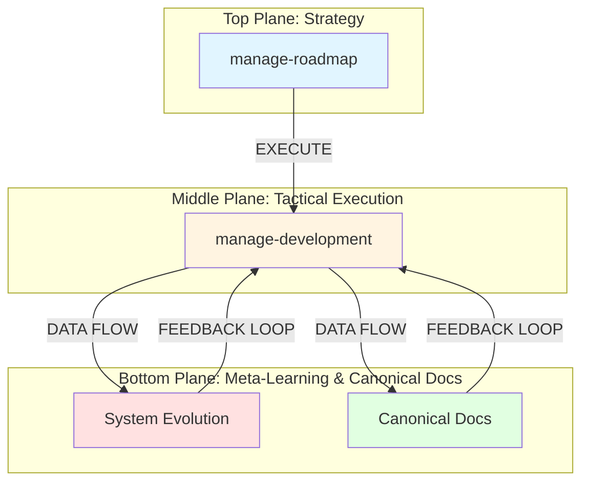

**Dual-Layer Management Architecture**:

| Strategic Layer                                   | Tactical Layer                                      |
| ------------------------------------------------- | --------------------------------------------------- |
| `manage-roadmap`                                  | `manage-development`                                |
| Defines roadmap priorities and creates milestones | Orchestrates the SDD pipeline for active milestones |
| Sets the "What & Why"                             | Guides the "How" execution                          |

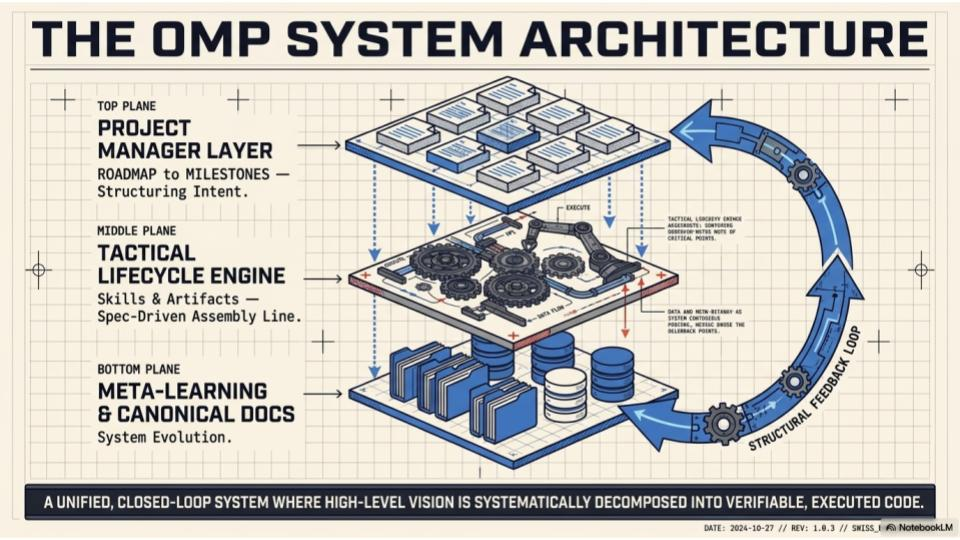

**Structural Feedback Loop**:

- Tactical Lifecycle Engine delivers: requirements, constraints, workshop notes, critical points
- Meta-Learning returns: data and action memory as system constraints, patterns, and decision points

> **"A unified, closed-loop system where high-level vision is systematically decomposed into verifiable, executed code."**

### 💡 Wisdom

This is a **hierarchical control system** inspired by:

- **Management hierarchies** (Strategic → Tactical → Operational)
- **Computer architecture** (Application → OS → Hardware)
- **Biological systems** (Brain → Spinal Cord → Reflex Arcs)

The feedback loop is critical — it's not just top-down decomposition. The bottom layer _learns_ from execution and feeds constraints back up. This creates a **self-improving system** where institutional knowledge accumulates in canonical docs rather than being lost in context windows.

The "Spec-Driven Assembly Line" metaphor is deliberate: manufacturing achieved reliability through assembly lines (Ford), not by making individual craftsmen more skilled. Similarly, OMP achieves reliable AI engineering through process, not through better prompting.

---

## Deterministic Workflow

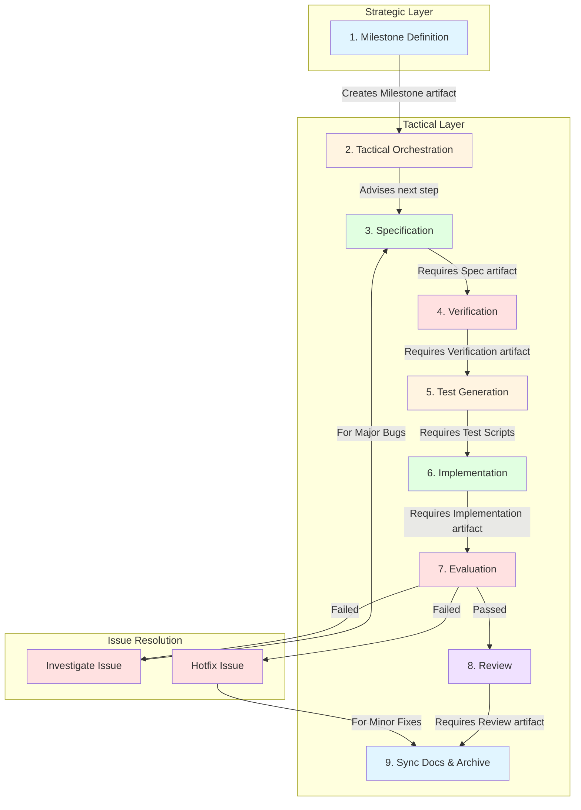

> **"AI agents don't just write code. They advance artifacts through a strict deterministic workflow. Each stage strictly requires the completion of the previous artifact."**

### 💡 Wisdom

This is **Waterfall done right** — not as a rigid methodology, but as a _state machine_. The key insight is that **stages don't proceed until the artifact is complete**. This prevents the "90% done" trap where implementation starts before requirements are understood.

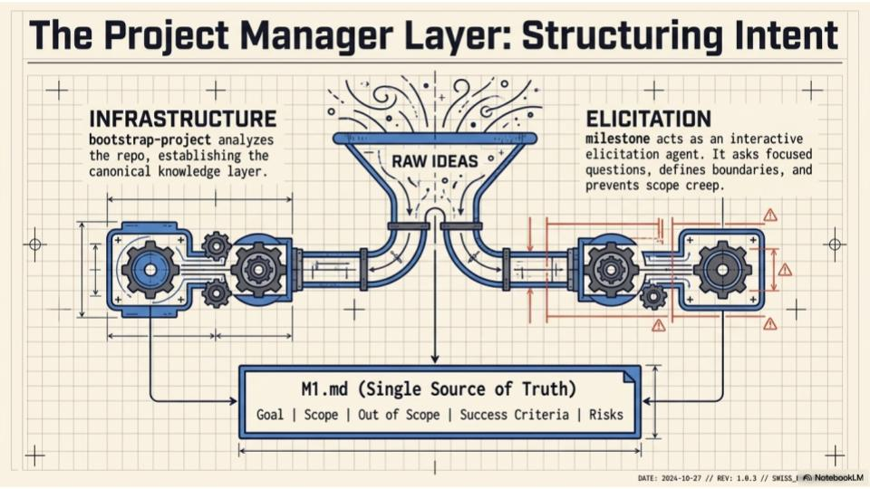

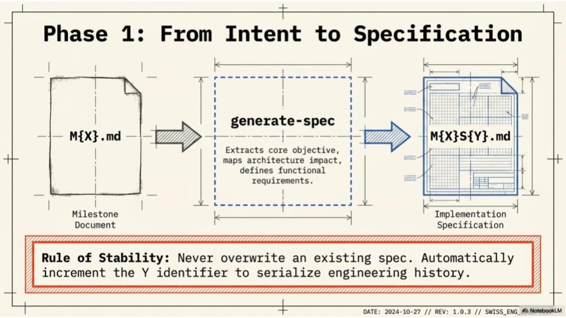

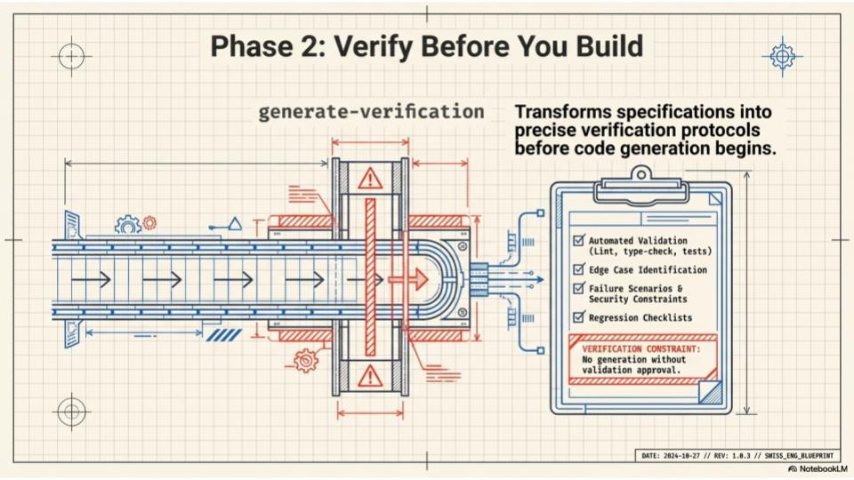

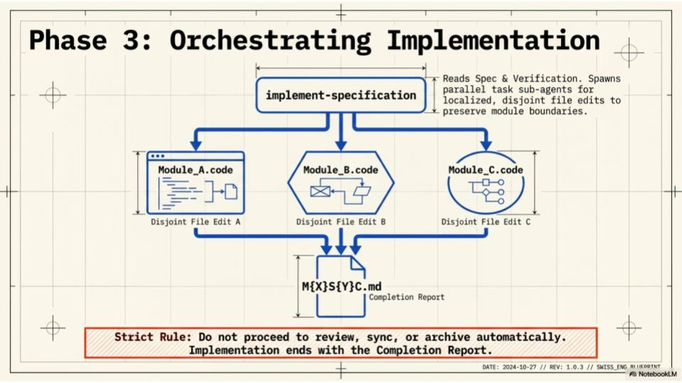

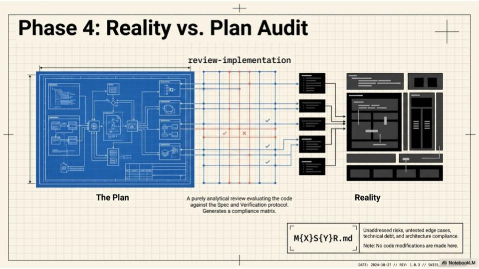

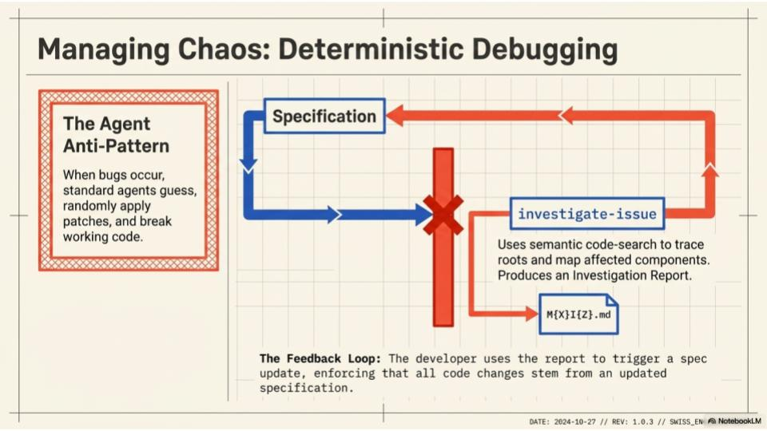

The "strictly requires completion" rule means:

- No coding during specification
- No testing during coding
- No reviewing during testing

This seems slow, but it prevents the **context thrashing** that kills productivity in standard agentic workflows. Each agent enters with a clear mandate and exits with a complete artifact.

```flowchart TD
    A[Product Manager<br/>Defines Requirements] -->|Creates Milestone artifact| B[Project Manager<br/>Plans Sprint]
    B -->|Advises next step| C[Business Analyst<br/>Writes Specifications]
    C -->|Requires Spec artifact| D[QA Lead<br/>Designs Test Strategy]
    D -->|Requires Verification artifact| E[Test Engineer<br/>Develops Test Cases]
    E -->|Requires Test Scripts| F[Developer<br/>Implements Feature]
    F -->|Requires Implementation artifact| G[CI/CD Pipeline<br/>Runs Automated Tests]
    G -- Passed --> H[Code Reviewer<br/>Reviews Code]
    G -- Failed --> J[Major Bug<br/>Found]
    G -- Failed --> K[Minor Bug<br/>Found]
    J -->|For Major Bugs| C
    K -->|For Minor Fixes| I[Release Manager<br/>Prepares Deployment]
    H -->|Requires Review artifact| I

    %% Styles
    style A fill:#e1f5ff
    style B fill:#fff4e1
    style C fill:#e1ffe1
    style D fill:#ffe1e1
    style E fill:#fff4e1
    style F fill:#e1ffe1
    style G fill:#ffe1e1
    style H fill:#f0e1ff
    style I fill:#e1f5ff
    style J fill:#ffe1e1
    style K fill:#ffe1e1
```

> **"AI agents don't just write code. They advance artifacts through a strict deterministic workflow. Each stage strictly requires the completion of the previous artifact."**

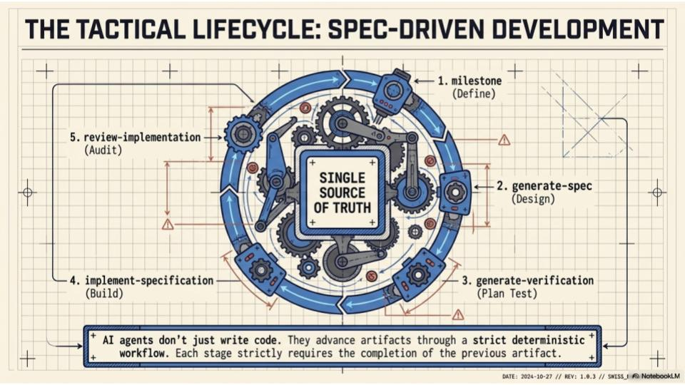

---

1. **Agent/Tool Separation** — Strategy vs. Execution
2. **One Transform at a Time** — Single responsibility
3. **Deterministic Outputs** — Pure functions, no hidden state
4. **Artifact Persistence** — Immutable, versioned Markdown
5. **Spec Before Code** — Verification precedes implementation
6. **Disjoint File Edits** — Parallel agents, no race conditions
7. **Read-Only Audit** — Analysis without modification
8. **Investigate Before Patch** — Root cause, not symptom
9. **Skill Evolution & Meta-Learning** — Analyzes project artifacts to improve agent prompts and skill definitions.
10. **Human Checkpoints** — Completion reports, not auto-proceed

---

## Lifecycle Skills

| Skill                     | Description                                                  | Handoff                                        |
| ------------------------- | ------------------------------------------------------------ | ---------------------------------------------- |
| `manage-roadmap`          | Strategic PM: Creates milestones from roadmap priorities     | Hands off to `manage-development`              |
| `manage-development`      | Tactical EM: Orchestrates SDD pipeline for active milestones | Advises next skill in sequence                 |
| `generate-spec`           | Transforms milestone → specification                         | `generate-verification`                        |
| `generate-verification`   | Transforms specification → verification                      | `generate-tests`                               |
| `generate-tests`          | Transforms verification → test scripts                       | `implement-specification`                      |
| `implement-specification` | Transforms test scripts → implementation                     | `evaluate-implementation`                      |
| `evaluate-implementation` | Executes tests, fixes bugs, generates evaluation             | `review-implementation` or `investigate-issue` |
| `investigate-issue`       | Analyzes failures, produces investigation report             | `generate-spec` (for incremental spec)         |
| `hotfix-issue`            | Implements minor fixes directly                              | `sync-documentation`                           |
| `review-implementation`   | Evaluates implementation against spec                        | `sync-documentation`                           |
| `sync-documentation`      | Updates canonical docs, archives milestone                   | Lifecycle complete                             |

---

## Quick Start

```bash
# 1. Bootstrap existing repository
$ omp bootstrap-project

# 2. Generate next milestone (strategic)
$ omp manage-roadmap    # Creates M{X}.md from roadmap priorities

# 3. Run the lifecycle (tactical)
$ omp manage-development    # Orchestrates SDD pipeline steps automatically

# 4. Archive when complete
$ omp sync-documentation   # Updates docs and archives milestone
```

---

## Stability Rules

1. Never overwrite existing specifications — incrementing `{Y}` automatically
2. Investigation reports never trigger direct implementation — route through spec
3. Implementation always produces `M{X}S{Y}C.md` completion report
4. Archive operations update `docs/MILESTONES.md` index
5. Each agent reads state before writing

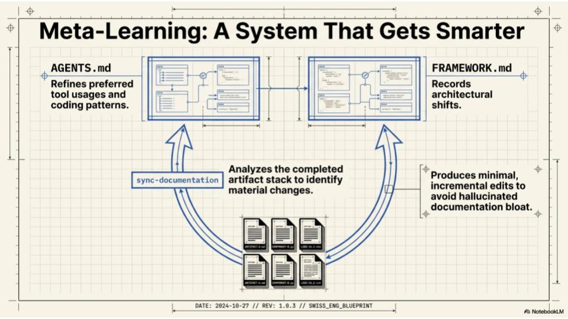

---

## Why SDD Wins


| Dimension     | Standard Agentic AI    | OMP SDD                              |
| ------------- | ---------------------- | ------------------------------------ |
| **Execution** | Ad-hoc prompt chaining | Serialized artifacts                 |
| **Quality**   | Post-generation fixes  | Pre-generation verification          |
| **Debugging** | Localized patches      | Semantic investigation → spec update |
| **Memory**    | Context window loss    | Immutable disk history               |


---

## License

MIT

---

## About the Developer & ParlanTech

Developed by [Barış Parlan](https://bparlan.com/).

Barış Parlan is an independent technology consultant and Agentic Engineer dedicated to building technology that augments human capability and enhances human agency, rather than increasing dependence.

The OhMyPi (OMP) Agentic Engineering Framework is a core project developed under his independent engineering lab, ParlanTech. The framework reflects a deep commitment to exploring how autonomous software can expand developer empowerment through local-first AI, specification-driven workflows, and robust agent collaboration.

### Consulting & Collaboration

Barış is actively open to consulting opportunities, research collaborations, and builder residencies.
His expertise is tailored to help AI companies, developer tool platforms, and open-source ecosystems design, architect, and implement production-grade agentic systems.
If your organization is looking to build stable AI workflows, optimize developer experiences, or transition into agentic architectures, he is available for technical partnership and consulting.

### Support Independent Engineering

This framework—alongside other projects like [Autonomedia](https://github.com/bparlan/autonomedia) and [Baria](https://github.com/bparlan/baria)—is built on a foundational belief in open knowledge, building in public, and utilizing open protocols to create healthier digital ecosystems.

As an independent developer, sustaining this level of deep, architectural research requires financial stability. If you or your organization derive value from the OMP framework and wish to see it advance, financial contributions and open-source sponsorships are highly welcomed.
Your support directly sustains this independent engineering effort, ensuring the continued development of these critical technological frontiers without the need for traditional gatekeepers.

For consulting inquiries, sponsorships, or to offer financial support, please reach out via GitHub or the contact channels provided on the website.
