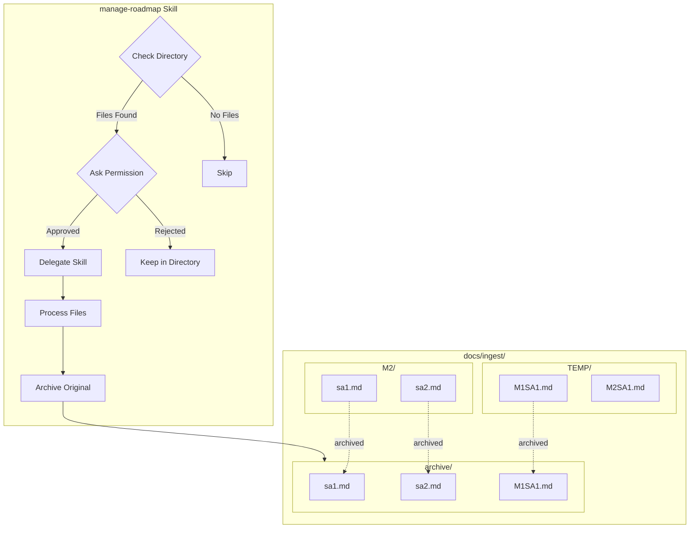
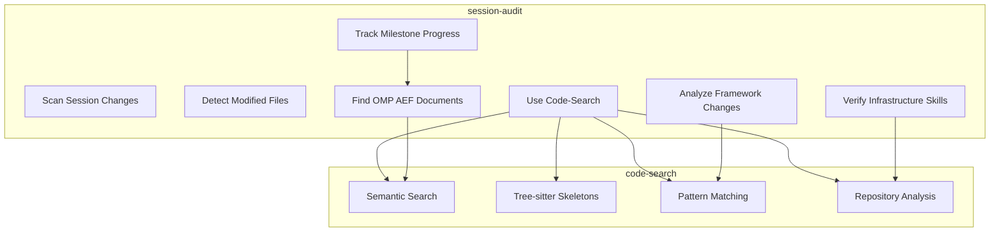
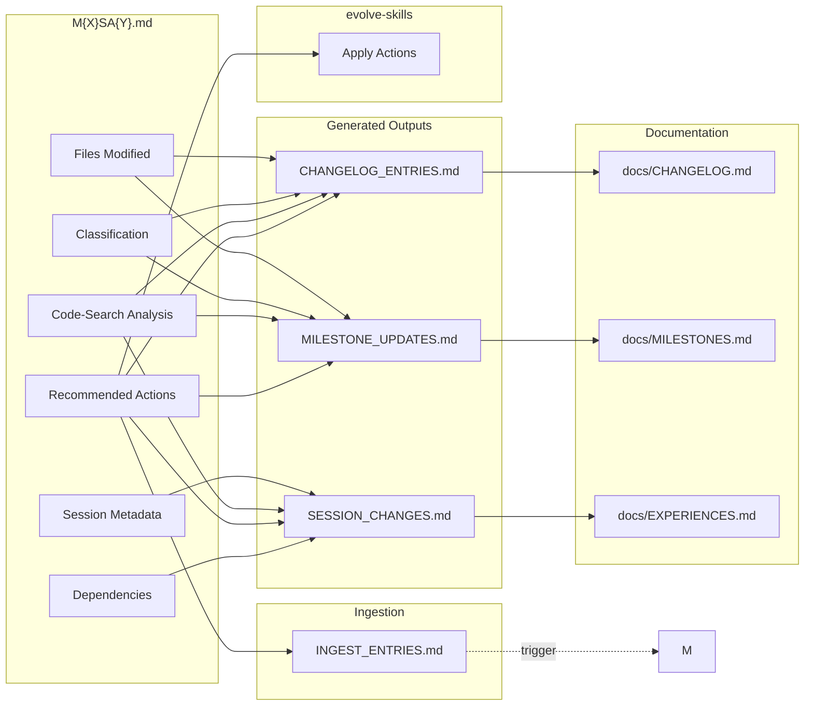
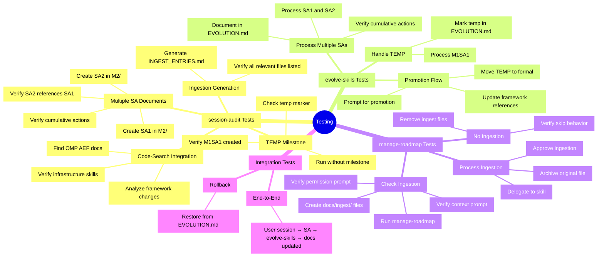
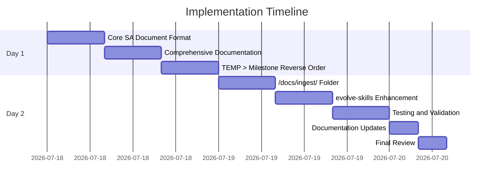

# Implementation Plan Diagrams

## Session Flow Diagram

```mermaid
flowchart TD
    subgraph UserSession["User Session"]
        A[Edit Framework Files] --> B[No milestone > development]
    end

    subgraph sessionAudit["session-audit Skill"]
        B --> C[Detect Milestone]
        C --> D{Milestone Exists?}
        D -->|Yes| E[Create M{X}SA{Y}.md]
        D -->|No| F[Create TEMP M{N}SA{Y}.md]
        E --> G[Analyze Changes]
        F --> G
        G --> H[Generate Outputs]
    end

    subgraph Outputs["Generated Outputs"]
        H --> I[M{X}SA{Y}.md]
        H --> J[SESSION_CHANGES.md]
        H --> K[CHANGELOG_ENTRIES.md]
        H --> L[MILESTONE_UPDATES.md]
        H --> M[INGEST_ENTRIES.md]
    end

    subgraph Documentation["Documentation Updates"]
        K --> N[docs/CHANGELOG.md]
        L --> O[docs/MILESTONES.md]
        K --> P[docs/EXPERIENCES.md]
        L --> Q[docs/ROADMAP.md]
    end

    subgraph Ingestion["Ingestion Process"]
        M --> R[Check /docs/ingest/]
        R --> S{Files Found?}
        S -->|Yes| T[Ask Permission]
        S -->|No| U[Skip Ingestion]
        T --> V{Approved?}
        V -->|Yes| W[Delegate to Skill]
        V -->|No| X[Archive Later]
        W --> Y[Archive Original]
    end

    subgraph evolveSkills["evolve-skills Skill"]
        I --> Z[Process Multiple SAs]
        I --> AA[Handle TEMP Milestones]
        I --> AB[Apply Improvements]
        AA --> AC[Promote TEMP to Formal]
        AB --> AD[Document in EVOLUTION.md]
    end

    subgraph Final["Final State"]
        N --> AE[Updated docs]
        O --> AE
        P --> AE
        Q --> AE
        I --> AF[SA Documents Tracked]
        F --> AF
        Y --> AG[Archived Files]
        AD --> AH[Framework Consistent]
    end

    I -.->|references| J
    J -.->|changes| K
    K -.->|changelog entries| N
    L -.->|milestone updates| O
    M -.->|ingest entries| R
```

## TEMP > Milestone Flow

```mermaid
flowchart LR
    subgraph Decision["Decision Tree"]
        A[Start] --> B{Milestone Exists?}
        B -->|Yes| C[Use Existing Milestone]
        B -->|No| D{TEMP Milestone Exists?}
        D -->|Yes| E[Use Existing TEMP]
        D -->|No| F[Create New TEMP]
    end

    subgraph Processing["Processing"]
        C --> G[Create SA1.md]
        E --> G
        F --> G
        G --> H[Process Changes]
    end

    subgraph Output["Output"]
        H --> I[M{X}SA{Y}.md]
        H --> J[Recommended Actions]
    end

    subgraph evolveSkills["evolve-skills"]
        I --> K[Process SA Documents]
        J --> K
        K --> L{Any TEMP Milestones?}
        L -->|Yes| M[Promote TEMP to Formal]
        L -->|No| N[Continue]
    end

    subgraph Final["Final State"]
        M --> O[Formal Milestone]
        N --> P[Continue with Current]
    end
```

## Ingestion Directory Structure



## SA Document Numbering Strategy

```mermaid
graph LR
    subgraph Normal["Normal Milestone"]
        M2[M2]
        SA1[SA1.md]
        SA2[SA2.md]
        SA3[SA3.md]
        SA4[SA4.md]

        M2 --> SA1
        SA1 --> SA2
        SA2 --> SA3
        SA3 --> SA4
    end

    subgraph TEMP["Without Milestone"]
        TEMP[TEMP/]
        M1SA1[M1SA1.md]
        M2SA1[M2SA1.md]
        M3SA1[M3SA1.md]

        TEMP --> M1SA1
        M1SA1 --> M2SA1
        M2SA1 --> M3SA1
    end

    subgraph Promotion["Promotion Flow"]
        P1[Start with TEMP]
        P2[Prompt for Permission]
        P3[Promote to Formal]
        P4[Move SA Document]

        M1SA1 --> P1
        P1 --> P2
        P2 --> P3
        P3 --> P4
        P4 --> M1
    end

    M1 -.->|promoted from| TEMP
    SA1 -.->|moved from| TEMP
```

## Code-Search Integration Flow



## Output File Dependencies



## Testing Matrix



## Decision Flow

```mermaid
flowchart TD
    subgraph Input["Input"]
        A[User Session Work]
        B[Modified Files]
    end

    subgraph Decision["Decisions"]
        C{Milestone Exists?}
        D{File is Cosmetic?}
        E{Files in /docs/ingest/?}
    end

    subgraph Actions["Actions"]
        F[Create SA Document]
        G[Skip Documentation]
        H{User Approved?}
        I[Delegate Skill]
        J[Archive File]
        K{Temp to Formal?}
    end

    subgraph Output["Output"]
        L[M{X}SA{Y}.md]
        M[SKIP]
        N[Change Applied]
        O[File Archived]
        P[Promoted to Formal]
    end

    A --> B
    B --> C
    C -->|Yes| F
    C -->|No| G
    B --> D
    D -->|Yes| G
    D -->|No| H
    B --> E
    E -->|Yes| H
    E -->|No| I
    H -->|Yes| I
    H -->|No| M
    I --> J
    I --> K
    K -->|Yes| P
    K -->|No| N

    F --> L
    G --> M
    I --> O
```

## Timeline



---

All diagrams provided for implementation visualization and testing strategy.
